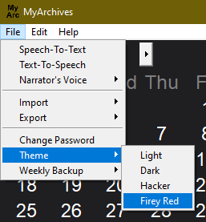

# This guide will help you to make custom theme for MyArchives

## Step 1 -

Go in 'MyArchives' folder, then go in 'gui' folder then open 'themes.py' file in your preffered text editor

`MyArchives\gui\themes.py`

---

## Step 2 -

Go to line 81 of 'themes.py' and read the instructions, rename the 'custom_theme' with your preffered theme name, make sure -

1. Name should always start with letter
2. No spaces in between the name

For example -

```python
def firey_red(window, entry_box, text_box, cal):
def grassy_green(window, entry_box, text_box, cal):
def sea_blue(window, entry_box, text_box, cal):
```

Once you picked a name of your choice, edit the given options to your desire. If you didn't used some options, make sure to remove/delete it.

---

## Step 3 -

While editing the colors, you also have to try them, to do that, open main_gui.py file and go to line number 155. Do as written there -

- Change the 'Theme Name' with your desired name (Write the name inside apostropy)
- Rename 'custom_theme' with the name you used in theme.py

For example -

```python
theme_menu.add_command(
        label="Firey Red", command=lambda: firey_red(window, entry_box, text_box, cal)
    )
```

---

## Step 4 -

After completing step 3, go to line number 228 of main_gui.py and do as directed. Rename the 'custom_theme' with your theme name which you used in step 2 and step 3 then run the program

For example -

```python
elif mode == "99":
    firey_red(window, entry_box, text_box, cal)
```

---

## Step 5 -

To run the program, navigate to MyArchives folder and run MyArchives.py file. To test your theme -

1. Go to 'File' in menubar
2. Navigate to 'Theme'
3. Select your theme to try it out



If there are any errors, it will show up in terminal of your text editor

---

## Extra

If there are any errors which you or guide can't able to solve, you can always open an issue on github or ask in the [disscussion](https://github.com/EdwinRodger/MyArchives/discussions/categories/q-a) section.

If you want to show your masterpiece to others, make a pull request and I will merge it :D

If there are any mistakes in the guide, you are always welcome to correct it :)
